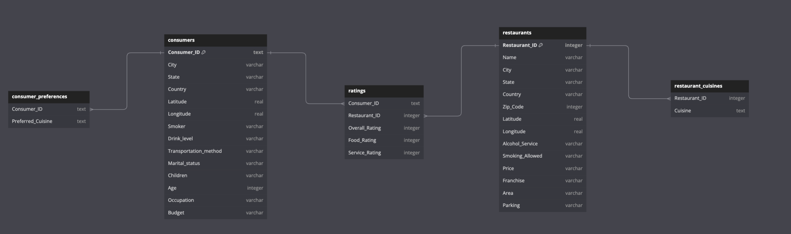
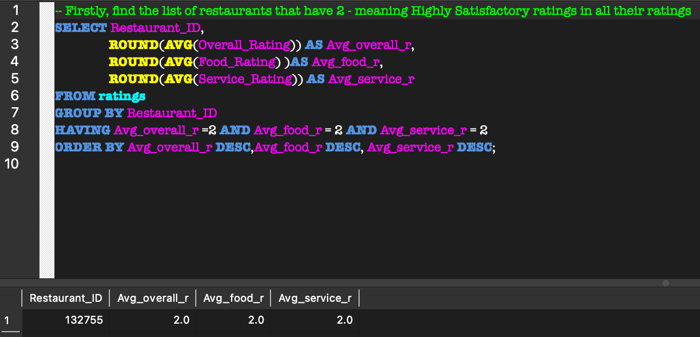
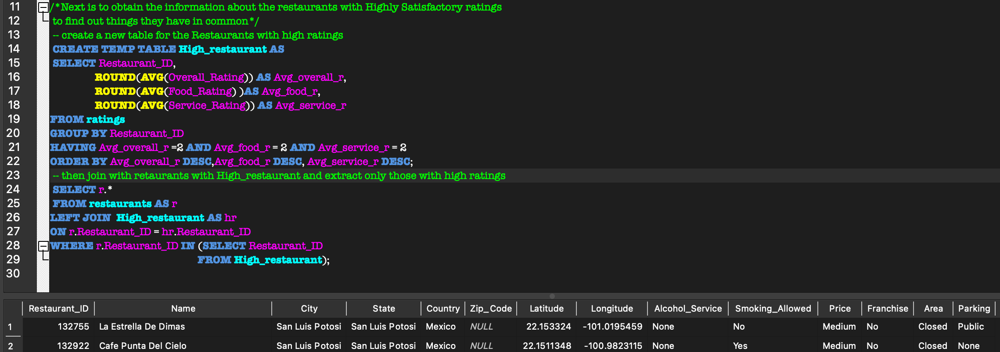

# Gastronomic Insights - Unveiling the Flavors of Mexico🌮 ⭐

# Background:
In the bustling streets of Mexico, where culinary delights blend with vibrant cultures, a treasure trove of data awaits exploration. Welcome to "Gastronomic Insights," a thrilling data analytics project that delves into restaurant ratings, consumer preferences, and the diverse world of Mexican cuisines.

# Setting the Stage:
It's the year 2012, and Mexico's restaurant scene is thriving with a multitude of flavors and experiences. The data for this project comes from a comprehensive survey conducted by a team of food enthusiasts who set out to capture the authentic opinions of real consumers regarding their dining experiences. These connoisseurs visited restaurants all across Mexico, covering bustling cities, coastal towns, and remote regions, to ensure a representative and diverse sample.

# The Data:
Our dataset includes several files that provide valuable insights into the Mexican restaurant landscape:

* consumer_preferences.csv: This file contains data on consumer preferences, including dietary restrictions, ambiance choices, and preferred cuisines.

* consumers.csv: Here, we find profiles of the consumers who participated in the survey. The data includes demographic information such as age, gender, and location, as well as dining frequency.

* data_dictionary.csv: This file serves as a guide, providing explanations for the various data fields present in the other files, ensuring clarity and ease of analysis.

* ratings.csv: This crucial file contains restaurant ratings given by consumers. Each entry includes the consumer ID, the restaurant ID, and the corresponding rating provided by the consumer for that restaurant.

* restaurant_cuisines.csv: This dataset sheds light on the cuisines offered by each restaurant. It includes details such as restaurant ID, cuisine type, and any specialty dishes they might be known for.

* restaurants.csv: This file provides additional information about each restaurant, such as its location, price range, ambiance, and other characteristics.
# Data Model:

# Analytical Problems:

* Unveiling the Highest-Rated Restaurants: The first challenge in this project is to extract valuable insights from the highest-rated restaurants. What sets them apart? Do they have specific common characteristics or unique offerings that contribute to their exceptional ratings? Analyzing these top-rated establishments could provide invaluable lessons for aspiring restaurateurs.

* Influence of Consumer Preferences on Ratings: It's essential to understand the relationship between consumer preferences and restaurant ratings. Are there any trends that emerge? For instance, do restaurants catering to specific preferences, such as dietary restrictions or ambiance choices, tend to receive higher ratings? This analysis can help restaurants tailor their offerings to better match their target audience's desires.

* Demographics and Bias in Data Sampling: Exploring consumer demographics is another critical aspect of this project. Are certain age groups or regions overrepresented in the data? Is there any indication of bias in the data sampling that could skew the overall results? Understanding the demographics will enable a more comprehensive interpretation of the findings and their real-world implications.

* Uncovering Demand & Supply Gaps: The project aims to identify demand and supply gaps in the market. Are there specific cuisines or restaurant types that are highly sought after by consumers but are underrepresented in the current market? This analysis could unveil untapped opportunities for entrepreneurs and investors in the culinary industry.

* Ideal Characteristics for Restaurant Investment: Lastly, the project seeks to determine which characteristics are crucial when considering investing in a restaurant. Through data analysis, we aim to identify factors that contribute to a restaurant's long-term success, including factors like location, cuisine offerings, price range, and ambiance.
# Analytical Answers:
* Unveiling the Highest-Rated Restaurants: SQL is used to extract a list of restaurants with high ratings in overall ratings, food ratings, and service ratings, the result is uploaded to Excel to identify common characteristics and unique offerings through visualization.

High Rating Restaurants        |     High Restaurant Features
:----------------------------: | :---------------------------------: 
           |   

Skill Demonstrated: 
* Agggregate
* Joins
* Subquery

*Uncovering Demand & Supply Gaps: This uses the customers preferred cuisines and the restaurant's cuisines to check if the supply meets the demand.

# Conclusion
"Gastronomic Insights - Unveiling the Flavors of Mexico" embarks on a journey through the vibrant Mexican culinary landscape, backed by data and fueled by curiosity. By leveraging data analytics and SQL, this project seeks to unravel the secrets of successful restaurants, consumer preferences, and hidden opportunities, all while painting a vivid picture of the diverse and delicious world of Mexican cuisine. So let's embark on this tantalizing exploration, discovering new dimensions of gastronomy and making informed decisions for a flavor-packed future!
# Source: 
Maven Data Playground
